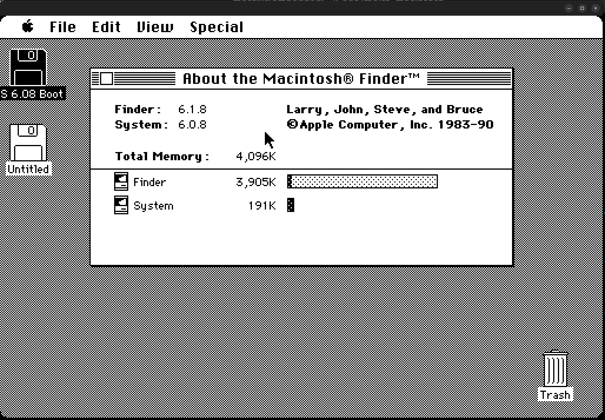
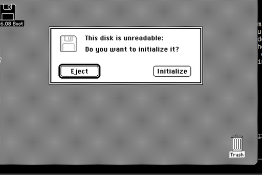

# moira_macintosh

A small **Macintosh SE** emulator for Linux/X11. It boots a real Macintosh SE
ROM and a System 6 disk image and runs the classic Mac OS desktop, driven by the
[**Moira**](https://github.com/dirkwhoffmann/Moira) Motorola 68000 CPU core.



The screenshot above shows the emulator after booting `testdata/OS_608_boot.dsk`
(System 6.0.8): the classic Finder desktop with the boot floppy, a hard-disk
volume, and the Trash. Keyboard and mouse (including clicks) are fully working
through the emulated Apple Desktop Bus (ADB). 

## CPU core: Moira (Motorola 68000)

| | |
|---|---|
| **CPU core** | [Moira](https://github.com/dirkwhoffmann/Moira) — a cycle-exact Motorola 68k emulator |
| **CPU model** | **Motorola 68000** (`Model::M68000`, cycle-exact), matching the real Macintosh SE — configured in [`src/cpu/moira_cpu.cc`](src/cpu/moira_cpu.cc) via `setModel(moira::Model::M68000)` |
| **Moira license** | **MIT License** — Copyright © Dirk W. Hoffmann, <https://www.dirkwhoffmann.de> |

Moira itself supports the 68000 through the 68040; this project uses the
cycle-exact **68000** core because that is the processor in the Macintosh SE.
The Moira sources live unmodified (except for `MoiraConfig.h`) in the
[`moira/`](moira/) directory and each file carries the MIT license header.

## Emulated hardware

- Motorola 68000 CPU @ ~7.8 MHz (Moira core)
- 4 MB RAM, 256 KB Macintosh SE ROM
- 512 × 342 1-bit monochrome video (displayed at 3× / 1536 × 1026)
- VIA 6522 (interrupts, timers, ADB shift register)
- Apple Desktop Bus (ADB) keyboard and mouse
- IWM / Sony floppy driver (1.44 MB disk images)
- SCSI hard disk (raw disk-image file)
- Real-time clock (RTC) and SCC (stubbed)

## Requirements

- Linux with an X11 display
- [Bazel](https://bazel.build/) (module/`bzlmod` based build)
- A C++20 compiler (GCC/Clang)
- X11 development headers (`libX11`)
- A Macintosh SE ROM at `testdata/MacSE.ROM` and a bootable disk image

## Building

```sh
bazel build //src:moira_macintosh
```

The binary is produced at `bazel-bin/src/moira_macintosh`.

## Running

```sh
./bazel-bin/src/moira_macintosh testdata/OS_608_boot.dsk testdata/hd20.img
```

Arguments are disk images in drive order: the first is the boot floppy, the
second (and beyond) are mounted as additional drives / hard disks. The ROM path
is `testdata/MacSE.ROM` (see `RomFileName` in [`src/config.h`](src/config.h)).

### Controls

- **Mouse** — move and click as usual inside the window (relative ADB mouse).
- **Keyboard** — maps host keys to the Mac keyboard via ADB.
- **Ctrl-Q** — quit the emulator.

If a mounted image is not a valid Mac volume, the Mac will offer to initialize
it — this is normal:



### Debug logging

The emulator runs quietly by default. To enable the verbose bring-up trace
(device accesses, ADB traffic, Sony driver intercepts, etc.), build with
`EMU_DEBUG` set to `1` in [`src/debug_log.h`](src/debug_log.h).

## Project layout

```
moira/            Moira 68000 CPU core (MIT, Dirk W. Hoffmann) — vendored
src/
  main.cc         Entry point, memory map wiring, ROM patches
  emulator.cc     Emulation tick loop
  cpu/            MoiraCpu — Moira subclass with the Mac memory bus
  devices/        VIA, ADB, IWM/Sony, SCSI, SCC, RTC, video, ROM
  platform/       X11 window / input / framebuffer backend
  config.h        Machine configuration (Macintosh SE, 4 MB)
testdata/         MacSE.ROM and disk images
```

## Licensing & attribution

- The surrounding machine emulation (devices, platform, configuration) is
  derived from **[Mini vMac](https://www.gryphel.com/c/minivmac/)** by Paul C.
  Pratt, which is distributed under the **GNU General Public License v2**.
  Because of this, **the project as a whole is licensed under GPL-2.0** — see
  [`LICENSE`](LICENSE).
- The **Moira** CPU core in [`moira/`](moira/) is by **Dirk W. Hoffmann** and is
  licensed under the **MIT License** — see [`moira/LICENSE`](moira/LICENSE). Its
  MIT terms are compatible with, and preserved under, the combined GPL-2.0 work.
- The Macintosh SE ROM and disk images in [`testdata/`](testdata/) contain
  Apple copyrighted material, checked in here for convenience (see
  [`testdata/README.md`](testdata/README.md)).
